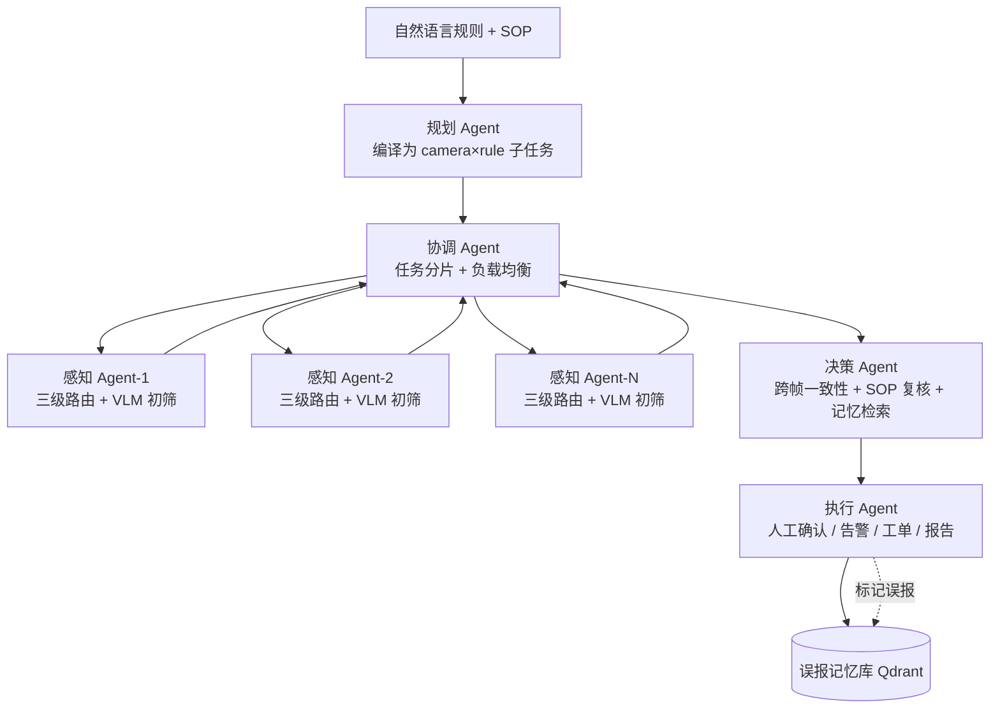

# GuardEye — 多模态自主巡检系统

基于 **多 Agent 协作 + LangGraph 编排 + MCP 工具层** 的工地/园区安全巡检系统。用自然语言定义巡检规则，
多个 Agent 自动规划任务、调度视觉模型分析视频、记忆历史误报，人工确认后生成结构化告警与报告。
感知 Agent 无状态、可水平扩展，新增巡检项无需训练模型。

---

## 项目简介

传统监控依赖人工盯屏，传统 CV 每换一条规则都要重训模型。GuardEye 把「规则即配置」做成一个完整的
Agent 闭环：

1. **自然语言规则** + SOP 作为输入；
2. **规划 Agent** 对已知规则走关键词表确定性编译，对陌生规则通过 ReAct（思考→查 SOP→推理）
   自主探索并输出结构化子任务；
3. **感知 Agent** 用三级模型路由分析视频片段，产出候选发现；
4. **决策 Agent** 做跨帧一致性复核、SOP 核对、历史误报检索；
5. **执行 Agent** 触发人工确认 / 告警 / 工单，并把误报写回记忆库。


---

## 系统架构



**三级模型路由**是成本控制核心：**运动检测（免费）→ 抽帧去重（低成本）→ 小 VLM 初筛（有成本）→
大模型二次确认（只处理少量可疑流量）**。

**多 Agent 协作**是扩展性核心：感知 Agent 为**无状态服务**，路数增加时直接增加实例，协调 Agent
负责任务分片与故障恢复。

单 Agent 流水线：`plan → fetch → dispatch → verify → memory_filter → hitl → report → notify`，
由 LangGraph `StateGraph` 编排，支持 checkpoint 断点续跑与 interrupt 人工介入。

---

## 核心特性

| 特性 | 说明 |
|------|------|
| **多 Agent 协作** | 规划 + 协调 + 感知 + 决策 + 执行，感知层水平扩展 |
| **A2A 通信** | Redis Stream 异步分发 + HTTP 同步调用，ACK 保证交付 |
| **LangGraph 状态图** | checkpoint 断点续跑 + interrupt 人工介入 + reducer 并发合并 |
| **ReAct 规则编译** | 规划 Agent 对陌生规则采用「思考 → 查 SOP → 推理」自主探索，已知规则走关键词表零成本编译 |
| **MCP 工具层** | JSON-RPC + `tools/list` 发现 + stdio/HTTP 双传输，5 个 Server |
| **三级模型路由** | 按「处理成本 × 信息密度」分层，成本可记账 |
| **跨帧一致性** | 单帧不采信，滑动窗口连续 N 帧才升级，防 VLM 幻觉 |
| **误报自学习记忆** | 结构化签名 + 向量检索 + 防污染规则，同类误报自动抑制 |
| **可观测** | 集成 Langfuse 追踪多 Agent 调用链路 |

---

## 技术栈

| 层次 | 技术 |
|------|------|
| Agent 编排 | LangGraph（`langgraph`） |
| 数据模型 | Pydantic v2 |
| 向量库 | Qdrant |
| 视频处理 | OpenCV（抽帧 / 帧差运动检测）、NumPy、Pillow |
| LLM / VLM | OpenAI 兼容端点（SGLang 部署 Qwen2.5-VL 等），默认 mock 降级 |
| Agent 间通信 | Redis Stream（多 Agent 分布式版） |
| 可观测 | Langfuse |
| 前端复核台 | Streamlit |

---

## 目录结构

```
guard-eye-agent/
├── agents/                     # 核心包（单 Agent 版）
│   ├── models.py               # 数据模型（Rule / Finding / Alarm / Report）
│   ├── state.py                # PatrolState + reducer
│   ├── config.py               # 集中配置（环境变量 + 默认值双层）
│   ├── llm.py                  # LLM / VLM 客户端（真实 + mock）
│   ├── toolbox.py              # 5 个 MCP Server 的访问封装
│   ├── prescreen/              # L0 运动检测 / L1 抽帧去重 / L2 VLM / 路由
│   ├── memory/                 # 误报记忆 / 事件记忆 / 向量存储 / embedding
│   ├── nodes/                  # LangGraph 各节点
│   └── workflow.py             # 主状态图 + 纯 Python 降级流水线
│
├── multi_agent/                # 多 Agent 分布式版
│   ├── a2a_protocol/           # 消息格式 + Redis Stream 通信
│   ├── orchestrator/           # 协调 Agent（任务分片、结果聚合）
│   ├── planner_agent/          # 规划 Agent（规则解析、任务分解）
│   ├── perception_agent/       # 感知 Agent（三级路由，无状态，可水平扩展）
│   ├── decision_agent/         # 决策 Agent（复核、记忆检索、风险定级）
│   └── action_agent/           # 执行 Agent（人工确认、告警工单、报告）
│
├── mcp_servers/                # 自研 MCP 核心 + 5 个 Server + 客户端
│   ├── _core.py / mcp_client.py
│   ├── camera_registry/        # 摄像头注册与取流
│   ├── video_analysis/         # 视频片段分析
│   ├── knowledge/              # SOP / 历史事件检索
│   ├── alarm/                  # 告警创建与抑制
│   └── ticket/                 # 工单与通知
│
├── eval/                       # 评测集标注 + 指标 + 基线 + 回归入口
├── frontend/                   # Streamlit 复核台（可选）
├── infra/                      # Qdrant / Langfuse / SGLang 部署
├── scripts/
│   ├── demo.py                 # 端到端 demo（单 Agent，误报闭环）
│   └── demo_multi_agent.py     # 多 Agent demo（1 协调 + 2 感知）
├── tests/                      # 单元测试（不依赖 GPU / API key）
└── docs/architecture.md        # 架构与设计决策详解
```

---

## 快速开始

### 环境要求

- Python 3.11+
- Docker —— 用于 Qdrant / Redis / 多 Agent 集群

### 安装

```bash
pip install -e ".[dev]"
```

### 运行单元测试

```bash
pytest                # 或 make test
```

测试不依赖 GPU / API key / 视频文件。

### 单 Agent（误报记忆闭环）

```bash
python scripts/demo.py        # 或 make demo
```

demo 会演示「误报 → 人工标记 → 下次自动抑制」的闭环：三轮巡检中，同类告警在第 3 轮被自动抑制。
说明：demo 使用 `ScriptedScreen` 注入命中结果模拟 VLM 命中，非真实视觉理解；接真实后端见下文。

### 多 Agent（分布式）

```bash
# 1. 起基础设施（Qdrant + Redis）
docker compose up -d qdrant redis       # 或 make infra

# 2. 运行多 Agent demo（1 协调 + 2 感知线程）
python scripts/demo_multi_agent.py      # 或 make demo-multi

# 3. 或用 docker compose 起完整多 Agent 集群（需构建镜像）
docker compose --profile multi-agent up -d
```
